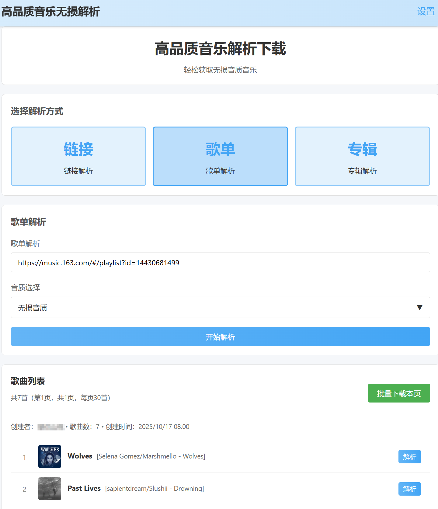
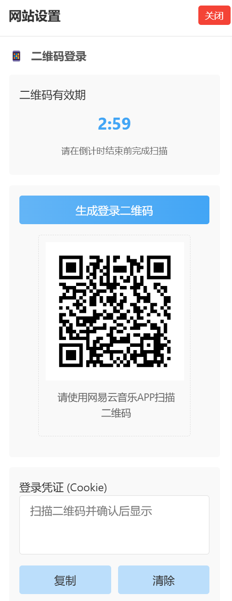

# 云音乐无损解析

---

本项目由[苏晓晴](https://github.com/Suxiaoqinx)的代码修改而来，在此致敬感谢！

## 一、Docker Compose 部署

通过 `docker-compose.yml` 可快速部署服务，配置如下：

```yaml
version: '3.8'
services:
  musiclover:
    image: leonautilus/musiclover:latest
    container_name: musiclover
    restart: always
    ports:
      - "5151:5151"  # 映射容器端口到主机
    volumes:
      - ./config.yaml:/app/config.yaml  # 配置文件映射
      - ./logs:/app/logs  # 日志目录映射，用于查看运行日志
      - ./downloads:/app/downloads  # 下载目录映射
    environment:
      - TZ=Asia/Shanghai  # 设置时区为上海，确保时间同步
```

### 部署步骤：
1. 创建 `docker-compose.yml` 文件，复制上述配置
2. 在同级目录创建 `config.yaml`，按格式填写网易云音乐黑胶会员Cookie（可不填cookie，直接部署后扫码更新cookie）
3. 执行部署命令：`docker-compose up -d`
4. 访问服务：打开浏览器访问 `http://localhost:5151`
5. 在网页的右上角【设置】中，扫码登录云音乐，系统自动更新cookie，无需手动填写
6. 查看日志：`docker-compose logs -f`
7. 可以通过config.yaml中的ENABLE_QR_CODE变量控制扫码功能是否显示

## 二、项目说明

### ⚠️ 重要声明
本项目为开源软件，遵循 MIT 许可证。任何个人或组织可自由使用、修改和分发源代码，但本项目及衍生作品**禁止用于商业或付费项目**。违反者将视为侵犯许可证，欢迎在遵守开源精神的前提下贡献代码。


### 📸 网站效果展示
以下为服务运行后的界面效果（点击可查看大图）：

| 首页界面 | 扫码界面 |
|--------------|--------------|
|  |  |

> 提示：实际使用时请将上述图片链接替换为真实截图（可存放于项目根目录的`docs`文件夹，使用相对路径引用，如`./docs/home.png`）


### ✨ 功能特性

#### 🎵 核心功能
- 🔍 歌曲搜索：支持关键词检索网易云音乐库歌曲
- 🎧 单曲解析：获取单首歌曲的详细信息及下载链接
- 📋 歌单解析：批量提取歌单中所有歌曲的信息
- 💿 专辑解析：批量获取专辑内所有歌曲的信息
- ⬇️ 音乐下载：支持多种音质的音乐文件下载

#### 🎼 音质支持
- `standard`：标准音质 (128kbps)
- `exhigh`：极高音质 (320kbps)
- `lossless`：无损音质 (FLAC)
- `hires`：Hi-Res音质 (24bit/96kHz)
- `jyeffect`：高清环绕声
- `sky`：沉浸环绕声
- `jymaster`：超清母带


### 环境要求
- Python 3.12+
- 网易云音乐黑胶会员账号（需获取Cookie用于高音质解析）

### 支持的链接格式
```
# 歌曲链接
https://music.163.com/song?id=1234567890
https://music.163.com/#/song?id=1234567890

# 歌单链接
https://music.163.com/playlist?id=1234567890
https://music.163.com/#/playlist?id=1234567890

# 专辑链接
https://music.163.com/album?id=1234567890
https://music.163.com/#/album?id=1234567890

# 直接使用ID
1234567890
```


### 注意事项
- 高音质资源（无损、Hi-Res等）需使用黑胶会员账号的Cookie才能解析
- Cookie格式需严格按照配置文件示例填写，确保有效性


### 致谢
- [苏晓晴](https://github.com/Suxiaoqinx)